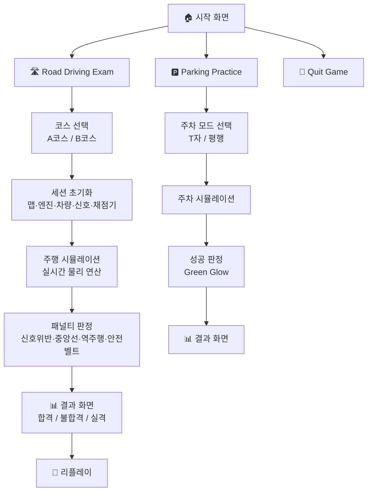

<h1 align="center">
  🚗 Best Driver
</h1>

<p align="center">
  <strong>C++ 기반 2D 운전면허 도로주행 시뮬레이터</strong>
</p>

<p align="center">
  
  
  
  
</p>

<p align="center">
  실제 운전면허 시험장을 2D로 재현한 도로주행 연습 프로그램<br/>
  A·B 코스 주행 · T자/평행 주차 · 패널티 판정 · 리플레이까지
</p>

<br/>

---

<br/>

## 💡 한눈에 보기

|  | 기능 | 설명 |
|:------:|:------|:------|
| 🛣️ | **A코스 주행** | 시내 도로, 교차로, 신호등, NPC 차량 |
| 🔄 | **B코스 주행** | 회전교차로, 복합 도로 환경 |
| 🅿️ | **T자/평행 주차** | 실제 시험 규격 기반 주차 시뮬레이션 |
| ⚖️ | **패널티 판정** | 신호 위반·중앙선 침범·역주행·안전벨트 |
| 🔁 | **리플레이** | 주행 영상 재생·속도 조절·패널티 시점 확인 |
| 🎮 | **물리 엔진** | 가속·감속·조향·기어 시스템 구현 |

<br/>

---

<br/>

## 📌 프로젝트 개요

**Best Driver**는 자동차 면허 시험 기반의 2D 도로주행 시뮬레이터입니다. 국가 면허 2종 보통 시험의 A·B 코스와 T자·평행 주차장을 정밀하게 구현하여, 실제 시험장과 유사한 환경에서 반복 연습할 수 있습니다.

### 핵심 목표

- **실제 시험 코스의 디지털 재현** — 면허 시험장 규격을 바탕으로 도로, 횡단보도를 좌표 기반으로 정밀 배치
- **실시간 물리 연산 기반 판정** — 차량의 위치와 조향각을 실시간 계산하여 신호 위반, 차선 이탈, 주차 성공 여부를 실제 시험 기준에 맞춰 판정
- **안전한 환경에서의 반복 학습** — 가상 시뮬레이션과 주행 리플레이 기능으로 실수를 확인하고 교정

<br/>

---

<br/>

## 🛠 개발 환경

<table>
  <tr>
    <th align="center">Language</th>
    <th align="center">Graphics</th>
    <th align="center">UI</th>
    <th align="center">IDE</th>
  </tr>
  <tr>
    <td align="center">
      
    </td>
    <td align="center">
      
    </td>
    <td align="center">
      <br/>
      <sub>+ ImGui-SFML</sub>
    </td>
    <td align="center">
      
    </td>
  </tr>
</table>

<br/>

---

<br/>

## 👥 팀 구성

<table>
  <tr>
    <th align="center">이름</th>
    <th align="center">역할</th>
    <th align="center">담당</th>
  </tr>
  <tr>
    <td align="center"><b>염재니</b></td>
    <td align="center">팀장</td>
    <td>코드 병합, 메인 루프, 차량 물리 엔진, 공용 타입 설계</td>
  </tr>
  <tr>
    <td align="center"><b>송현우</b></td>
    <td align="center">부팀장</td>
    <td>코드 병합, 모든 화면의 렌더링 제작</td>
  </tr>
  <tr>
    <td align="center"><b>이승민</b></td>
    <td align="center">팀원</td>
    <td>신호등·패널티 로직, 감점·체크포인트 판정, 리플레이</td>
  </tr>
  <tr>
    <td align="center"><b>김수영</b></td>
    <td align="center">⭐ 팀원</td>
    <td><b>A/B코스·평행주차·T자주차 맵 전체 제작, NPC 자동차 로직</b></td>
  </tr>
  <tr>
    <td align="center"><b>정서현</b></td>
    <td align="center">팀원</td>
    <td>시뮬레이션 완료 시 점수판 및 메뉴 제작</td>
  </tr>
  <tr>
    <td align="center"><b>정지수</b></td>
    <td align="center">팀원</td>
    <td>키보드 입력 차량 조작 상태 관리, 메인 화면 디자인</td>
  </tr>
</table>

<br/>

---

<br/>

## 🎮 주요 기능

<table>
  <tr>
    <td width="33%" valign="top">
      <h3>🛣️ 주행 시뮬레이션</h3>
      <p>
        <b>▸ A코스</b> - 시내 도로·심플 교차로<br/>
        <b>▸ B코스</b> - 회전교차로·복합 도로<br/>
        <b>▸ 동적 신호</b> - 녹22초·황3초·적2초<br/>
        <b>▸ NPC 차량</b> - 랜덤 배치·자동 주행
      </p>
    </td>
    <td width="33%" valign="top">
      <h3>🅿️ 주차 모드</h3>
      <p>
        <b>▸ T자 주차</b> - 수직 슬롯·게이트 판정<br/>
        <b>▸ 평행 주차</b> - 측면 슬롯<br/>
        <b>▸ 성공 판정</b> - Green Glow 연출<br/>
        <b>▸ 좌표 일치</b> - Rect 영역 기반 판정
      </p>
    </td>
    <td width="33%" valign="top">
      <h3>⚙️ 시스템</h3>
      <p>
        <b>▸ 물리 엔진</b> - 가속·감속·조향·충돌<br/>
        <b>▸ 기어</b> - P·R·N·D 변환 및 제한<br/>
        <b>▸ 리플레이</b> - 보간 재생·속도 조절<br/>
        <b>▸ 렌더링</b> - SFML+ImGui
      </p>
    </td>
  </tr>
</table>

<br/>

---

<br/>

## 🔄 시스템 흐름도



<br/>

---

<br/>

## 🚦 패널티 판정 시스템

| 위반 항목 | 판정 기준 | 결과 |
|:---:|:---|:---:|
| 🔴 신호 위반 | 빨간불에 교차로 통과 | 실격 (100점) |
| 🟡 중앙선 침범 | 차량이 중앙선을 통과 | 실격 (100점) |
| 🔵 역주행 | 반대차선에서 0.2초 이상 주행 | 실격 (100점) |
| ⚪ 안전벨트 | 주행 시 안전벨트 OFF | 실격 (100점) |

> **합격 기준** : 감점 합계 30점 이하 (70점 이상) / 100점 이상 감점 시 즉시 실격

<br/>

---

<br/>

## 🎮 조작법

| 키 | 기능 |
|:---:|:---|
| `↑` `↓` | 가속 / 브레이크 |
| `←` `→` | 좌회전 / 우회전 |
| `W` | 시동 ON/OFF |
| `D` `R` `N` `P` | 기어 변환 (전진/후진/중립/주차) |
| `S` | 브레이크 |
| `B` | 안전벨트 착용/해제 |
| 마우스 휠 | 화면 확대/축소 |

<br/>

---

<br/>

## 🗂️ 프로젝트 구조

```
📦 bestdriver_GENISIS/
├── 📄 main.cpp                    # 메인 루프, 세션 관리
├── 📄 Renderer.h / .cpp           # 화면 렌더링 (SFML + ImGui)
├── 📄 SimEngine.h / .cpp          # 차량 물리 엔진
├── 📄 MapSystem.h / .cpp          # 맵 생성 및 충돌 판정
├── 📄 TrafficSystem.h / .cpp      # 교통 신호 관리
├── 📄 VehicleState.h              # 차량 상태 구조체
├── 📄 InputHandler.h / .cpp       # 키보드 입력 처리
├── 📄 ExamEvaluator.h / .cpp      # 채점 및 패널티 판정
├── 📄 ReplaySystem.h / .cpp       # 리플레이 기능
├── 📄 NpcCar.h / .cpp             # NPC 차량 로직
└── 📂 assets/                     # 리소스 파일
```

<br/>

---

<br/>

## 🚀 빌드 및 실행

```bash
# 1. 저장소 클론
git clone https://github.com/your-username/bestdriver_GENISIS.git

# 2. Visual Studio에서 솔루션 파일 열기

# 3. SFML 및 ImGui-SFML 라이브러리 경로 설정

# 4. Release 모드로 빌드 후 실행
```

> **요구 사항** : Visual Studio 2019 이상, SFML 2.5+, ImGui + ImGui-SFML

<br/>

## 🎬 시연 영상

[](https://youtu.be/IXsHpMUysOo)

> 클릭하면 영상으로 이동합니다.

<br/>

## 📈 기대 효과

### 🎓 실감형 운전 교육
초보 운전자가 실제 도로에 나가기 전, 가상 환경에서 자동차 조작(시동, 기어 변속, 깜빡이 등)을 충분히 숙련하여 사고 위험을 감소시킬 수 있습니다.

### 🅿️ 주차 숙련도 향상
평행 주차, T자 주차 등 상황별 주차 공식을 가상 환경에서 반복 숙달하여 실제 차량 조작 시의 실수를 최소화할 수 있습니다.

### 📊 맞춤형 피드백
주행 중 감점 항목과 소요 시간을 실시간으로 기록하고, 종료 후 결과 화면과 리플레이로 본인의 실수를 객관적으로 파악할 수 있습니다. 향후 주행 데이터 분석을 통해 개인별 맞춤형 운전 가이드를 제공하는 시스템으로 확장 가능합니다.

<br/>

---

<br/>

## 📄 라이선스

이 프로젝트는 학습 목적으로 제작되었습니다.

<br/>

---

<p align="center">
  <b>GENISIS 팀</b><br/>
  <sub> 팀장: 염재니 | 부팀장: 송현우 | 팀원: 김수영, 이승민, 정서현, 정지수</sub>
</p>
